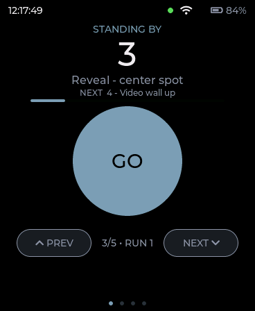
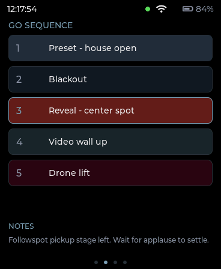
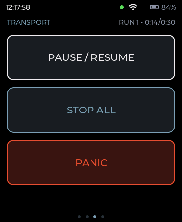
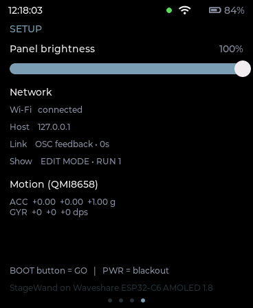

# StageWand

Handheld hardware cue controllers for
[StageWizard](https://github.com/virtualmagician/StageWizard), built on the
Waveshare **ESP32-C6-Touch-AMOLED-1.8** board (SKU 33305). A native macOS
simulator runs the *identical* LVGL C UI code the firmware runs on-device,
so screens are designed and debugged on a laptop before ever touching
hardware. The StageWizard link is live: OSC commands out, push status
feedback in (heartbeat, GO-sequence window, full cue list with color tags),
with automatic HTTP fallback — the same portable C link code will run over
the board's Wi-Fi 6.

## The four pages

| GO (home) | Cues | Transport | Setup |
|:---:|:---:|:---:|:---:|
|  |  |  |  |
| Standing-by cue, progress, PREV/NEXT | Scrollable GO sequence, color tags, tap to arm, notes | Pause/resume · stop all · panic | Brightness, Wi-Fi + OSC health, IMU |

*Captured from the simulator linked to `tools/mock_stagewizard.py` — pixel-identical to the 368×448 AMOLED.*

## Repository layout

```
Simulator/                  Swift package — the macOS simulator
├── Package.swift
├── Sources/
│   ├── SimCore/             C target: vendored LVGL 9.5.0 + simbridge + showui
│   │   ├── lvgl/             vendored LVGL 9.5.0 (unmodified upstream source)
│   │   ├── include/simbridge.h   the only header Swift talks to
│   │   └── showui/           device-portable UI — see "The rule that matters" below
│   └── AmoledSim/            SwiftUI app: window chrome, inspector panel, --snapshot mode
└── scripts/build_app.sh      packages a release build into dist/AmoledSim.app

firmware/                   UNTESTED ESP-IDF skeleton for the real board
└── showcontroller/           see firmware/README.md before building

tools/
├── mock_stagewizard.py       stand-in host: full remote surface incl. feedback + cue tags
└── test_link.sh              end-to-end link test (mock + headless simulator)

docs/plan.html                     the full research & plan document
docs/stagewizard-osc-requests.html the StageWand <-> StageWizard OSC contract, as built
docs/showlink.md                   link-layer notes (transports, liveness, timings)
```

## Quick start (simulator)

Needs only Xcode Command Line Tools — no Xcode project, no CocoaPods/SPM
registry access, nothing else to install.

```sh
cd Simulator
swift run AmoledSim              # windowed simulator, 368x448 canvas + inspector panel
```

Packaged `.app` (for double-clicking, or handing to someone else):
```sh
scripts/build_app.sh             # → dist/AmoledSim.app
```

Headless, for scripting/CI (renders one frame and exits; `--tile 0-3` picks
the page, `--link <host>` connects to a StageWizard first):
```sh
swift run AmoledSim --snapshot out.png
```

No StageWizard handy? Run the mock host and the simulator links to it
(the link defaults to on, host 127.0.0.1):
```sh
python3 tools/mock_stagewizard.py
```

## The rule that matters

Screens live **only** in `Simulator/Sources/SimCore/showui/` (`showui.h`,
`showui_hal.h`, `showui.c`, plus the `showlink.[ch]` StageWizard link), and
that C code is portable: it depends on nothing but LVGL, `showui_hal.h`,
and BSD sockets (identical on macOS and lwIP). It is compiled twice — once
into the macOS simulator, once into the firmware — from the same files on
disk (the firmware references the sources by relative path; never copied).

`showui_hal.h` is the *entire* boundary to the machine it runs on: battery,
IMU, RTC time, Wi-Fi status, BOOT/PWR buttons in; brightness out. Each
platform implements that HAL once — `simbridge.c` on macOS (fed by the
inspector panel's fake values), `firmware/showcontroller/main/showui_hal_device.c`
on-device (fed by real sensors). **Never add `#ifdef`-platform code inside a
screen.** If a screen needs to behave differently per platform, that
difference belongs in the HAL implementation, not in `showui.c`.

## The StageWizard link

`showui/showlink.[ch]` speaks the as-built contract in
[docs/stagewizard-osc-requests.html](docs/stagewizard-osc-requests.html)
(StageWizard v1.6.0 + dev D22/D27): OSC 1.0 over UDP `:53100` — commands out
(`go / stopall / next / prev / toggle / panic / cue/<n>/fire / cue/<n>/select`),
push status feedback in (standing-by, running + ~2 s heartbeat, panic, show
mode, GO-sequence window, notes, elapsed, and the chunked full cue list with
per-cue color tags). A 1 Hz `/stagewand/ping` keeps the subscription alive;
liveness adapts to the host (heartbeat staleness on D22+, connected-UDP ICMP
detection otherwise) with automatic `GET /status` HTTP fallback on `:53200`.
The UI renders StageWizard's family palette — MagicLab-blue GO and the six
cue-tag row tints.

## Hardware cheat sheet

| | |
|---|---|
| MCU | ESP32-C6, single-core RISC-V, 160 MHz |
| RAM | 512 KB HP SRAM — **no PSRAM** |
| Flash | 16 MB |
| Display | 368×448 AMOLED over QSPI (SPI2) |
| Display driver | V1: SH8601 · V2: CO5300 — BSP auto-detects by touch I2C address |
| Touch | V1: FT-family @ I2C 0x38 · V2: CST820 @ I2C 0x15 |
| IMU | QMI8658 (accel + gyro) |
| RTC | PCF85063A |
| Audio codec | ES8311 |
| PMU | AXP2101 |
| IO expander | TCA9554 |
| Shared I2C bus | GPIO7/GPIO8¹ — TCA9554, AXP2101, QMI8658, PCF85063A, ES8311, touch all share it |
| SPI2 contention | Display and microSD share SPI2 on different pins — **mutually exclusive**, cannot be active together |
| Full-frame cost | 368×448×2 bytes = **322 KB** — larger than all of SRAM, must be tiled |
| QSPI push time | ~16.5 ms to push a full 322 KB frame at 20 MB/s → caps full-frame redraw well under 60 fps |

¹ The board's marketing pinout lists GPIO7 as SDA / GPIO8 as SCL. The
official BSP header (`bsp/esp32_c6_touch_amoled_1_8.h`, fetched 2026-08-29)
defines it the other way — `BSP_I2C_SCL = GPIO7`, `BSP_I2C_SDA = GPIO8` —
and the official `01_AXP2101`/`02_PCF85063` examples' Kconfig defaults agree
with the header. Firmware code should always go through `bsp_i2c_get_handle()`
rather than hard-coding either pin, which sidesteps the question entirely;
if you're wiring by hand, trust the header over the marketing pinout and
verify with a continuity check.

## Key links

- Board docs — <https://docs.waveshare.com/ESP32-C6-Touch-AMOLED-1.8>
- Official examples repo — <https://github.com/waveshareteam/ESP32-C6-Touch-AMOLED-1.8>
- BSP on the ESP Component Registry — <https://components.espressif.com/components/waveshare/esp32_c6_touch_amoled_1_8>
- Community: chayuto's board notes — <https://github.com/chayuto/ESP32-C6-Touch-AMOLED-1.8>
- Community: espressif/esp-brookesia (the launcher framework used by the official `03_esp-brookesia` example) — <https://github.com/espressif/esp-brookesia>
- LVGL — <https://github.com/lvgl/lvgl>
